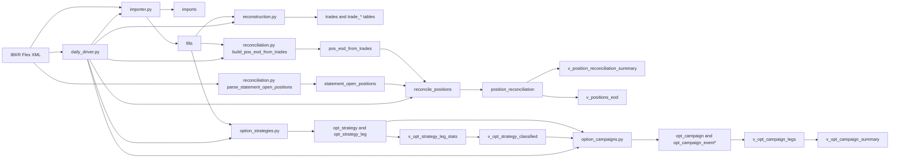

# Phase 2 Architecture

This document describes the Phase 2 portfolio and options pipeline as implemented on the `develop` branch. It focuses on the modules, SQLite artifacts, and runtime flow that were added to turn raw IBKR Flex data into position reconciliation and option campaign reporting.

## Module Inventory

### Runtime modules

| Module | Purpose | Main outputs |
| --- | --- | --- |
| `importer.py` | Fetches IBKR Flex XML or accepts local XML, archives raw payloads, de-dupes imports, parses fills, and stores them in SQLite. | `imports`, `fills` |
| `reconstruction.py` | Rebuilds journal trades from fills and links fills to trade-level records. | `trades`, `trade_fills`, `trade_legs`, `trade_options_summary` |
| `reconciliation.py` | Builds trade-derived end-of-day positions, ingests statement open positions, and compares the two books. | `pos_eod_from_trades`, `statement_open_positions`, `position_reconciliation` |
| `option_strategies.py` | Groups option fills into execution-level strategies using `order_reference` when present and a deterministic fallback when absent. | `opt_strategy`, `opt_strategy_leg` |
| `option_campaigns.py` | Rolls option strategies into higher-level campaigns and event history for premium-bank and break-even reporting. | `opt_campaign`, `opt_campaign_event`, `opt_campaign_event_leg` |
| `daily_driver.py` | Orchestrates the full Phase 2 batch pipeline from XML load through view refresh. | End-to-end pipeline execution |

### Phase 2 tables

| Table | Role |
| --- | --- |
| `statement_open_positions` | Raw end-of-day positions from IBKR Open Positions XML |
| `pos_eod_from_trades` | Trade-derived end-of-day position snapshot by account and instrument |
| `reconciliation_exceptions` | Manual overrides for known reconciliation mismatches |
| `position_reconciliation` | Row-by-row comparison result between trade-derived and statement positions |
| `opt_strategy` | Strategy header built from grouped option fills |
| `opt_strategy_leg` | Strategy legs linked back to source fills |
| `opt_campaign` | Campaign header for same-underlying, same-option-type lifecycle tracking |
| `opt_campaign_event` | Strategy-to-campaign lifecycle events |
| `opt_campaign_event_leg` | Join table from campaign events to strategy legs |

### Phase 2 views

| View | Role |
| --- | --- |
| `v_opt_strategy_leg_stats` | Aggregated strike, side, contract, and expiry statistics per strategy |
| `v_opt_strategy_classified` | SQL-based option structure classification layer |
| `v_opt_campaign_legs` | Event-level campaign rollup with cumulative premium bank and break-even math |
| `v_opt_campaign_summary` | One-row latest-state summary per campaign |
| `v_position_reconciliation_summary` | Account/date/status rollup for reconciliation |
| `v_positions_eod` | Reporting-ready reconciliation view joining trade, statement, and exception context |

### Regression coverage

- `tests/test_reconciliation.py` covers statement parsing, reconciliation storage, and `v_positions_eod`.
- `tests/test_option_strategies.py` covers grouping priority and strategy classification cases.
- `tests/test_option_campaigns.py` covers campaign accumulation, closure, realised P&L, and break-even math.
- `tests/test_daily_driver.py` covers the full local pipeline and duplicate rerun safety.
- `tests/test_database_migrations.py` covers schema version tracking and destructive derived-layer rebuilds.

## Data Flow

## Key Design Decisions

- Phase 2 is SQLite-first. Most business state is persisted as normalized tables plus reporting views, which keeps the daily driver simple and makes reruns idempotent.
- Reconciliation uses instrument-level snapshots instead of trade-level matching. `pos_eod_from_trades` is rebuilt from all fills up to a report date, then compared to statement rows keyed by account and instrument.
- `conid` is preferred when available for instrument identity. When absent, the symbol becomes the fallback instrument key.
- Strategy grouping prefers broker intent over heuristics. `option_strategies.py` uses `order_reference` first because it preserves the trader’s original multi-leg order boundary; fallback grouping uses account, underlying, broker order id, and timestamp.
- Strategy classification lives in SQL views, not Python enums. `v_opt_strategy_classified` derives labels from strike/expiry/side patterns so downstream consumers can query classifications directly.
- Campaigns are a second layer above strategies. A strategy is an execution bundle; a campaign is the lifecycle of repeated opens/adds/closes for the same account, underlying, and option type.
- Break-even and premium-bank math is view-driven. `v_opt_campaign_legs` computes cumulative cash-flow state, and `v_opt_campaign_summary` exposes the latest campaign state for reporting.
- The daily driver is the Phase 2 integration point. It executes import, reconstruction, trade-position build, strategy rebuild, campaign rebuild, reconciliation, and final view refresh in a fixed order.
- `database.py` owns schema versioning and derived-object rebuilds. `init_db(rebuild_derived=True)` drops and recreates the derived layer without touching raw imports, statement rows, or trade reconstruction tables.

## Rebuild Sequence

Use this sequence when you need to rebuild from an existing SQLite file without manually dropping tables:

1. Run `python database.py --rebuild-derived` to apply tracked migrations and recreate the derived schema objects empty.
2. Run `python daily_driver.py --xml-file <flex.xml> --statement-xml <positions.xml> --report-date YYYY-MM-DD --reset-derived` to repopulate the derived layer from imports, reconstructed trades, and statement positions in a single ordered pass.

For a brand-new SQLite file, `daily_driver.py` already applies migrations automatically, so `--reset-derived` is optional.

## Dependency Map

- `daily_driver.py` depends on `importer.py`, `reconstruction.py`, `reconciliation.py`, `option_strategies.py`, `option_campaigns.py`, and `database.py`.
- `reconciliation.py` depends on `database.py` and the `fills` table populated by `importer.py`.
- `option_strategies.py` depends on `database.py`, `fills`, and `option_parser.py` for option symbol decomposition.
- `option_campaigns.py` depends on `opt_strategy`, `opt_strategy_leg`, `fills`, and `v_opt_strategy_classified`.
- `v_positions_eod` depends on `position_reconciliation`, `pos_eod_from_trades`, and `statement_open_positions`.
- `v_opt_campaign_summary` depends on `opt_campaign`, `opt_campaign_event`, `opt_campaign_event_leg`, and `opt_strategy_leg` through `v_opt_campaign_legs`.

## Practical Reading Order

If you need to trace the implementation, read the modules in this order:

1. `daily_driver.py` for the orchestration sequence.
2. `importer.py` for XML ingestion and persistence entry points.
3. `reconciliation.py` for position-building and statement comparison.
4. `option_strategies.py` for execution-level grouping.
5. `option_campaigns.py` for lifecycle rollup and reporting semantics.
6. `database.py` for the schema and reporting views that tie the pipeline together.
